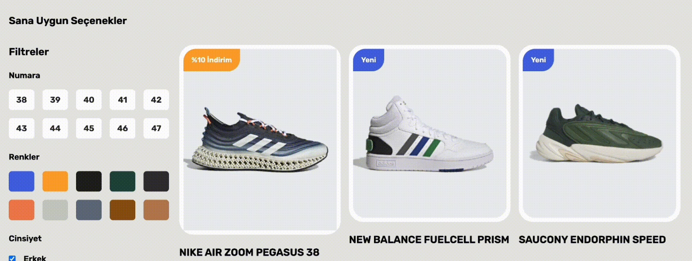

# Figma_Shoes_App

The Shoes-App is a modern, responsive web application designed for users to easily browse shoes and filter them based on criteria like price, gender, color, and size. It also allows users to check the detailed stock status of each shoe. With its mobile and desktop optimization, the app provides a seamless shopping experience across all devices.

# Tools and Libraries Used

- react-router-dom
- tailwind
- axios
- json-server
- @tanstack/react-query
- react-toastify
- xss

# Screenshots

# Figma

- https://www.figma.com/community/file/1214498651988846999
